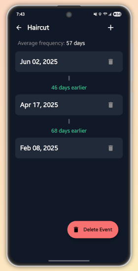
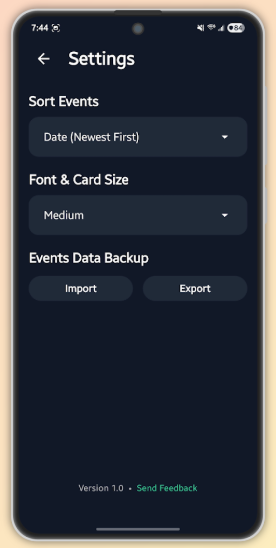

# Days Track

A modern Android app for tracking time for events with a beautiful Material Design interface.

<a href="https://play.google.com/store/apps/details?id=com.tk.daystrack"></a>

## Features

- **Event Management**: Create, edit, and delete events with custom titles and descriptions
- **Date Tracking**: Track days until or since events with intuitive date picker
- **Widget Support**: Home screen widget to display upcoming events
- **Modern UI**: Clean Material Design 3 interface with dark/light theme support
- **Settings**: Customizable app preferences and widget configuration
- **Responsive Design**: Optimized for various screen sizes and orientations

## Screenshots

| Home Screen | Event Details | Settings |
|-------------|---------------|----------|
|  |  |  |

## Technology Stack

- **Language**: Kotlin
- **UI Framework**: Jetpack Compose
- **Architecture**: MVVM with Repository pattern
- **Database**: Room Database
- **Widget**: App Widget with Compose
- **Build System**: Gradle with Kotlin DSL
- **Minimum SDK**: API 24 (Android 7.0)

## Project Structure

```
app/src/main/java/com/tk/daystrack/
├── components/          # Reusable UI components
│   ├── AppHeader.kt
│   ├── CommonComponents.kt
│   ├── DatePickerDialog.kt
│   ├── EventList.kt
│   ├── FloatingActionButtons.kt
│   └── HintBanner.kt
├── ui/theme/           # Theme and styling
│   ├── Color.kt
│   ├── Styling.kt
│   ├── Theme.kt
│   └── Type.kt
├── Event.kt            # Data model
├── EventRepository.kt  # Data access layer
├── EventViewModel.kt   # ViewModel for events
├── MainActivity.kt     # Main activity
├── EventDetailsScreen.kt
├── SettingsScreen.kt
├── AddEventDialog.kt
├── UpdateEventDialog.kt
├── EventWidgetProvider.kt
└── WidgetConfigActivity.kt
```

## Getting Started

### Prerequisites

- Android Studio Arctic Fox or later
- Android SDK API 24 or higher
- Gradle 7.0 or higher

### Installation

1. Clone the repository:
   ```bash
   git clone https://github.com/yourusername/days-track.git
   cd days-track
   ```

2. Open the project in Android Studio

3. Sync Gradle files and build the project

4. Run the app on an emulator or physical device

### Building

```bash
# Build debug APK
./gradlew assembleDebug

# Build release APK
./gradlew assembleRelease
```

## Usage

### Adding Events
1. Tap the floating action button (+)
2. Enter event title and description
3. Select the target date
4. Tap "Add Event"

### Managing Events
- Tap on any event to view details
- Long press to edit or delete events
- Use the settings screen to customize the app

### Widget Setup
1. Long press on home screen
2. Add "Days Track" widget
3. Configure widget settings in the app

## Architecture

The app follows the MVVM (Model-View-ViewModel) architecture pattern:

- **Model**: `Event` data class and `EventRepository`
- **View**: Compose UI components and activities
- **ViewModel**: `EventViewModel` managing UI state and business logic

### Key Components

- **EventRepository**: Handles data operations and persistence
- **EventViewModel**: Manages UI state and coordinates with repository
- **Compose UI**: Modern declarative UI built with Jetpack Compose
- **Widget**: Home screen widget using App Widget with Compose

## License

This project is licensed under the MIT License - see the [LICENSE](LICENSE) file for details.

## Acknowledgments

- Material Design 3 guidelines
- Jetpack Compose documentation
- Android developer documentation

## Support

If you encounter any issues or have questions, please use "Send Feedback" option in the app's settings page.

---

Made with ❤️ using Kotlin and Jetpack Compose 